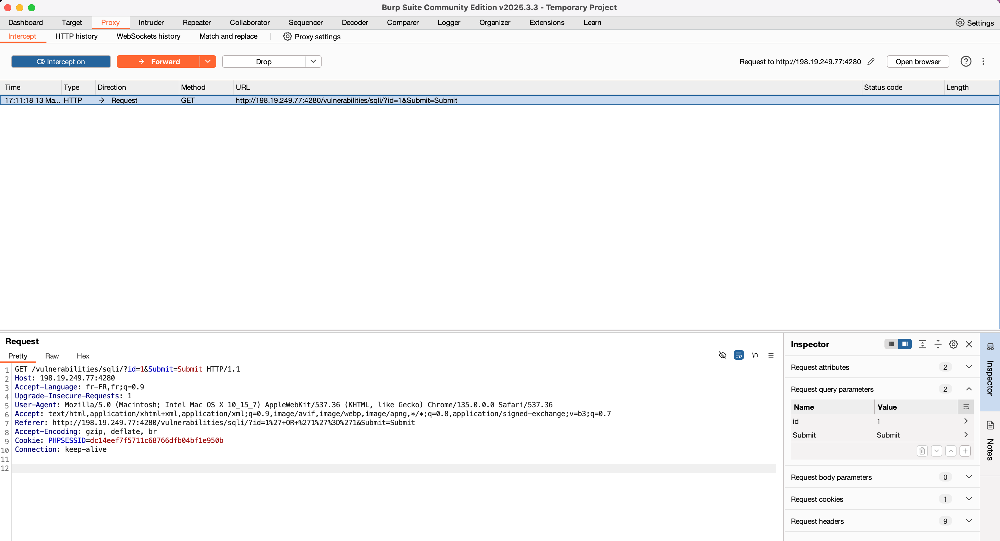
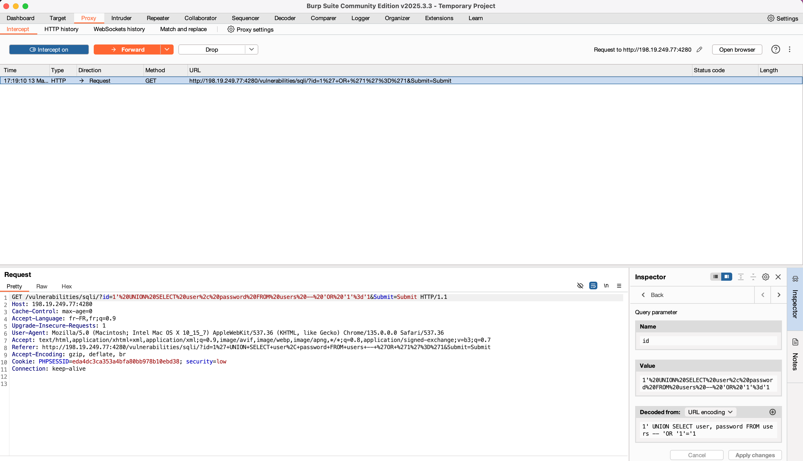
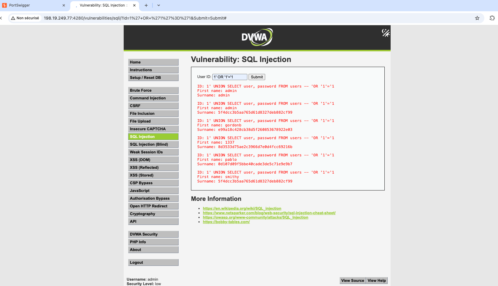

# 🧰 Interception avec Burp Suite

## Objectif :
Intercepter et modifier une requête HTTP contenant une injection SQL sur DVWA.

## Étapes :
1. Proxy activé dans Chromium (198.19.249.77:4280)
2. Interception d'une requête sur la page : `/vulnerabilities/sqli/`
    - Requête initiale :
    
3. Requête modifiée dans Burp :
    
4. Résultat de l'injection SQL :
    

## Analyse :
Burp permet d'intercepter et de modifier les requêtes HTTP, facilitant ainsi l'exploitation des vulnérabilités. Dans cet exemple, une injection SQL a été réalisée avec succès sur DVWA.